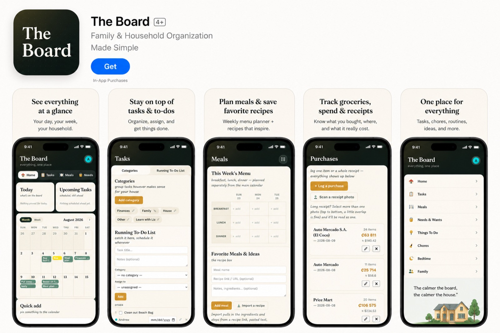

# The Board

A family hub web app: one shared place for the calendar, tasks, meals, purchases, chores and bedtimes.

**Live:** https://the-family-board.netlify.app (sign-in required; households are invite-only)



## Features

- **Home:** month and week calendar, today's items, quick add
- **Tasks:** categories, a running to-do list, assignment to family members
- **Meals:** weekly menu planner and a recipe box, with recipe import from a link
- **Purchases:** log purchases by hand or scan a receipt photo to extract the store, date and line items
- **Needs & Wants, Things To Do, Chores, Bedtime, Family**
- **Households:** each family's data is isolated; new members join with an invite code

## Tech

- **Front end:** a single HTML file with vanilla JavaScript and CSS (`family-hub.html`), no build step
- **Back end:** Supabase (Postgres, Auth, Storage) with row-level security on every table
- **Server functions:** Netlify Functions in `deploy/netlify/functions/`
  - `scan-receipt.js` reads receipt photos with the Claude API
  - `import-recipe.js` extracts a recipe from a web page
  - The API key is read from a Netlify environment variable and both functions check for a signed-in user first
- **Hosting:** Netlify (`deploy/`)

## Repository layout

| Path | What it holds |
|---|---|
| `family-hub.html` | The app |
| `deploy/` | The folder published to Netlify (`index.html` is a copy of the app) |
| `the-board-schema.sql` | Base database schema |
| `add-*.sql` | Feature migrations, run in the Supabase SQL editor |
| `security-fixes.sql`, `harden-invite-codes.sql`, `fix-*.sql` | Security hardening and fixes |
| `check-security-state.sql` | Read-only check of the current security rules |

## Running locally

```bash
python3 -m http.server 8791
```

Then open <http://localhost:8791/family-hub.html>. The receipt and recipe functions only run on Netlify.
